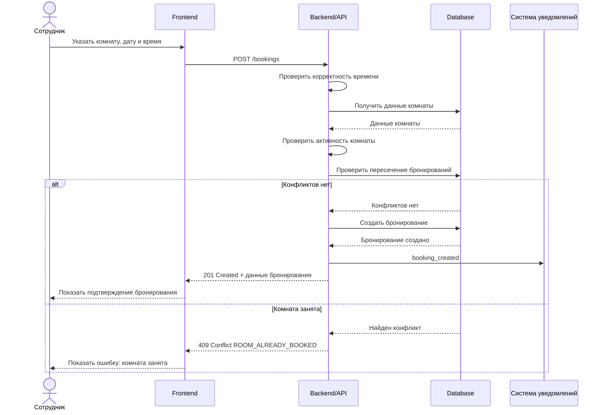

# UML Sequence Diagram: создание бронирования

Диаграмма описывает сценарий создания бронирования переговорной комнаты.

```mermaid
sequenceDiagram
    actor Employee as Сотрудник
    participant Frontend
    participant Backend as Backend/API
    participant DB as Database
    participant Notification as Система уведомлений

    Employee->>Frontend: Указать комнату, дату и время
    Frontend->>Backend: POST /bookings

    Backend->>Backend: Проверить корректность времени
    Backend->>DB: Получить данные комнаты
    DB-->>Backend: Данные комнаты

    Backend->>Backend: Проверить активность комнаты
    Backend->>DB: Проверить пересечение бронирований

    alt Конфликтов нет
        DB-->>Backend: Конфликтов нет
        Backend->>DB: Создать бронирование
        DB-->>Backend: Бронирование создано
        Backend->>Notification: booking_created
        Backend-->>Frontend: 201 Created + данные бронирования
        Frontend-->>Employee: Показать подтверждение бронирования
    else Комната занята
        DB-->>Backend: Найден конфликт
        Backend-->>Frontend: 409 Conflict ROOM_ALREADY_BOOKED
        Frontend-->>Employee: Показать ошибку: комната занята
    end
```