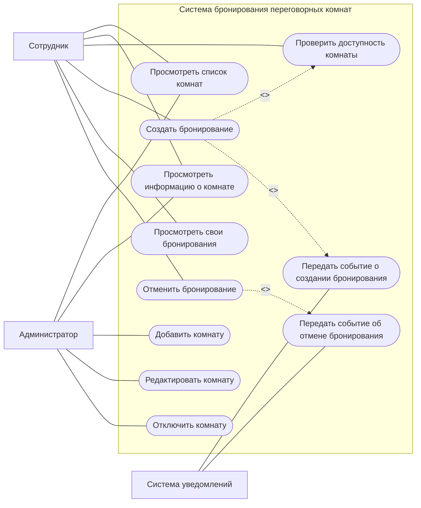

# UML Use Case Diagram

Диаграмма показывает акторов системы и основные сценарии использования системы бронирования переговорных комнат.

```mermaid
flowchart LR
    Employee[Сотрудник]
    Admin[Администратор]
    Notification[Система уведомлений]

    subgraph System[Система бронирования переговорных комнат]
        UC1([Просмотреть список комнат])
        UC2([Просмотреть информацию о комнате])
        UC3([Проверить доступность комнаты])
        UC4([Создать бронирование])
        UC5([Просмотреть свои бронирования])
        UC6([Отменить бронирование])

        UC7([Добавить комнату])
        UC8([Редактировать комнату])
        UC9([Отключить комнату])

        UC10([Передать событие о создании бронирования])
        UC11([Передать событие об отмене бронирования])
    end

    Employee --- UC1
    Employee --- UC2
    Employee --- UC3
    Employee --- UC4
    Employee --- UC5
    Employee --- UC6

    Admin --- UC1
    Admin --- UC2
    Admin --- UC7
    Admin --- UC8
    Admin --- UC9

    Notification --- UC10
    Notification --- UC11

    UC4 -. "<<include>>" .-> UC3
    UC4 -. "<<include>>" .-> UC10
    UC6 -. "<<include>>" .-> UC11
```