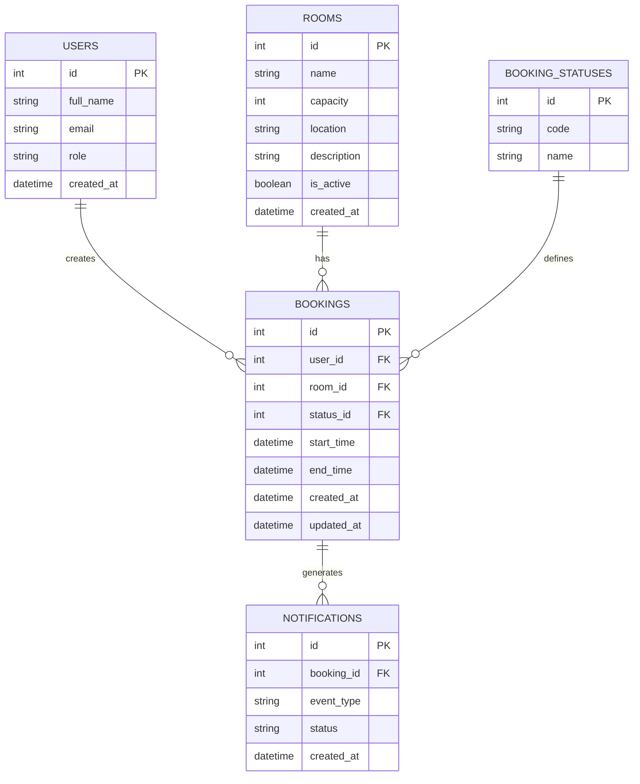

# ERD: модель данных системы бронирования переговорных комнат

Диаграмма показывает основные таблицы системы и связи между ними.

```mermaid
erDiagram
    USERS ||--o{ BOOKINGS : creates
    ROOMS ||--o{ BOOKINGS : has
    BOOKING_STATUSES ||--o{ BOOKINGS : defines
    BOOKINGS ||--o{ NOTIFICATIONS : generates

    USERS {
        int id PK
        string full_name
        string email
        string role
        datetime created_at
    }

    ROOMS {
        int id PK
        string name
        int capacity
        string location
        string description
        boolean is_active
        datetime created_at
    }

    BOOKING_STATUSES {
        int id PK
        string code
        string name
    }

    BOOKINGS {
        int id PK
        int user_id FK
        int room_id FK
        int status_id FK
        datetime start_time
        datetime end_time
        datetime created_at
        datetime updated_at
    }

    NOTIFICATIONS {
        int id PK
        int booking_id FK
        string event_type
        string status
        datetime created_at
    }
```