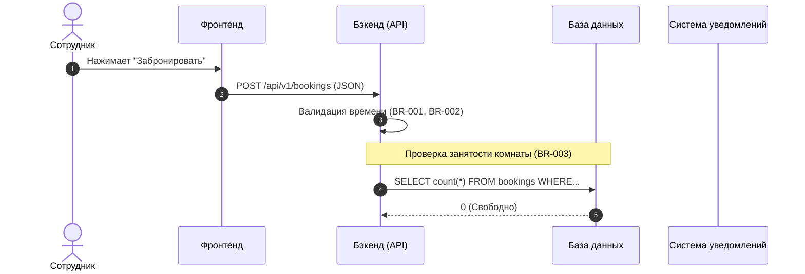

```mermaid
sequenceDiagram
    autonumber
    actor User as Сотрудник
    participant Front as Фронтенд
    participant API as Бэкенд (API)
    participant DB as База данных
    participant Notif as Система уведомлений

    User->>Front: Нажимает "Забронировать"
    Front->>API: POST /api/v1/bookings (JSON)
    API->>API: Валидация времени (BR-001, BR-002)
    
    Note over API,DB: Проверка занятости комнаты (BR-003)
    API->>DB: SELECT count(*) FROM bookings WHERE...
    DB-->>API: 0 (Свободно)

    %% ДОПИШИ ЗДЕСЬ ШАГИ УСПЕШНОГО СОХРАНЕНИЯ И УВЕДОМЛЕНИЯ
```